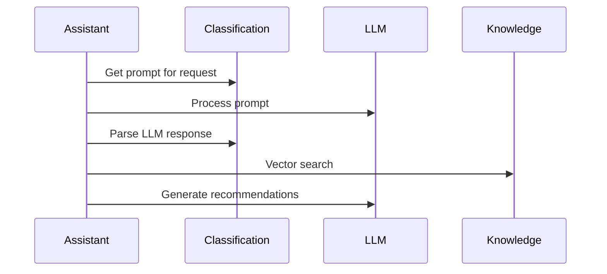

# AI Production Support Assistant

AI support assistant system that provides intelligent analysis and resolution recommendations for production issues using [Model Context Protocol](https://modelcontextprotocol.io/introduction) (MCP) architecture, section-level semantic search, and context-aware recursive knowledge retrieval.

## Quick Start

### 1. Install Dependencies
```bash
pip install -e .
```

### 2. Run Tests
```bash
python -m pytest tests/ -v
```

### 3. Demo Mode (Automated Scenarios)
```bash
python -m support_agent.cli demo --no-interactive
```

### 4. Demo Mode (Interactive)
```bash
python -m support_agent.cli demo
```

### 5. System Health Check
```bash
python -m support_agent.cli health
```

### 6. System Information
```bash
python -m support_agent.cli info
```

## Example Usage

```
> I booked a trade in Athena but it didn't show up in the MarkitWire feed

Classification: query/feed_issue (High Priority, 85% confidence)
```
### Troubleshooting Steps
1. **Check if there are any block events:**
   ```python
   deal = ro(dealName)
   ds = deal.DownstreamState("MarkitWire")
   ds.evInfo() # this should print out downstream events, such as update events and block events
   ```

2. **Make sure the downstream trade passes validation:**
   ```python
   deal = ro(dealName)
   fs = deal.FeedState("MarkitWire")
   dt = fs._DownstreamTrades()[0]
   dt.validate() # investigate validation failures
   ```

3. **Check eligibility object's IneligibilityReasons.**

```
Performance: 6 tools, 3.9k tokens, 10.0 seconds
```

## Key Features

- **Context-Aware Analysis**: Skips redundant steps based on user's stated facts  
- **Section-Level Search**: Granular semantic search at markdown section level for precise results  
- **Deterministic Follow-up Searches**: Consistent gap identification and implementation detail retrieval
- **Quality-Filtered Results**: Only includes follow-up content above relevance thresholds (30%+) 
- **LLM-Based Decisions**: No hardcoded business logic - all decisions made by LLM  
- **Comprehensive Source Attribution**: Clear traceability of primary sources and implementation details
- **Silent Mode**: Stays silent when no relevant knowledge is available  

## Core Capabilities

1. **Intelligent Request Analysis** - Context-aware analysis with section-level vector search
2. **Section-Level Knowledge Search** - Semantic similarity search at granular section level
3. **DFS Gap Detection** - Context-aware recursive searches for missing implementation details
4. **Smart Parameter Substitution** - Adapts code examples to user's specific context
5. **Silent Mode Decision Making** - Uses LLM to determine when to defer to humans

## Architecture
```
support_agent/
├── assistant.py              # Main orchestrator
├── cli.py                    # Command-line interface, interactive testbed
├── config.py                 # Configuration management
└── models.py                 # Pydantic data models

mcp_servers/
├── categories/
│   └── atrs.json              # Team-specific configuration
├── classification_server.py   # LLM-based classification, triage server
├── knowledge_server.py        # Vector search knowledge provider
└── health_server.py           # Health monitoring server (extension point)

knowledge_resources/           # Collection of knowledge assets
├── markitwire_feed_troubleshooting.md  # MarkitWire feed troubleshooting
├── feed_framework_troubleshooting.md   # Feed framework commands
├── data_reconciliation.md              # Data issue procedures
└── outage_investigation.md             # Outage response procedures

tests/
└── test_functional.py         # Comprehensive functional tests
```

## Key Architectural Decisions

### 1. **Vector Embeddings for Knowledge Search**
- Uses `sentence-transformers` with `all-MiniLM-L6-v2` model
- Server-side semantic search with cosine similarity

### 2. **LLM-Based Decision Making**
- Request handling decisions made by LLM analysis
- Gap detection uses LLM to find missing implementation details and can search deeper
- Context awareness through intelligent prompt engineering

### 3. **Generic Knowledge Base**
- Knowledge files should use parameterized examples (`feedType`, `dealName`)
- LLM can substitute parameters based on user context


### 4. **Client-Side LLM Pattern**


## Requirements

- Python 3.9+
- OpenAI or Anthropic API key for LLM processing
- `sentence-transformers` for vector embeddings
- `numpy>=1.26.4,<2.0` (for vector compatibility)

## Environment Variables

### Required
```bash
export OPENAI_API_KEY="your-openai-key"
```

### Optional Configuration
```bash
# LLM Configuration
export LLM_DEFAULT_MODEL="gpt-4o-mini"        # Default: gpt-4o-mini
export LLM_TEMPERATURE="0.3"                  # Default: 0.3
export LLM_MAX_TOKENS="1000"                  # Default: 1000
export LLM_TIMEOUT="30.0"                     # Default: 30.0 seconds
export LLM_API_BASE="https://api.openai.com/v1"  # Optional: custom API endpoint

# Network Configuration
export MCP_HOST="127.0.0.1"                   # Default: localhost
export MCP_PORT_BASE="8000"                   # Default: 8000 (servers use 8001, 8002, 8003)
```

## Testing

The system includes comprehensive functional tests:

- **CLI Integration Tests** - Tests all CLI commands end-to-end
- **Section-Level Search Tests** - Verifies granular semantic search functionality  
- **Context Awareness Tests** - Tests parameter substitution and context handling
- **Human Review Detection** - Tests LLM-based decision making
- **Generic Params Support** - Tests feed type substitution across different feeds

Run tests: `python -m pytest tests/ -v`

## Configuration

### Knowledge Search Depth
Control context-aware recursive knowledge search depth:
```bash
python -m support_agent.cli demo --search-depth 2  # DFS recursive search
python -m support_agent.cli demo --search-depth 1  # Single-level (default)
```

### Adding New Knowledge
1. Create markdown file in `knowledge_resources/`
2. Use clear header structure (# ## ### for hierarchical sections)
3. Use parameterized code examples with `feedType`, `dealName`, etc.
4. System automatically parses sections and creates embeddings on startup

### Example Knowledge File
```markdown
# Generic Troubleshooting Guide

## Commands
```python
deal = ro(dealName)
fs = deal.FeedState(feedType)  # Use specific feed name like "DCPP", "XODS", etc.
fs.FeedStatus()
```

The LLM will automatically substitute `feedType` with the actual feed type from user queries.

## Documentation

- [DEMO_GUIDE.md](DEMO_GUIDE.md) - Demo walkthrough guide  
- [simplified_flow_diagram.md](simplified_flow_diagram.md) - System flow overview
