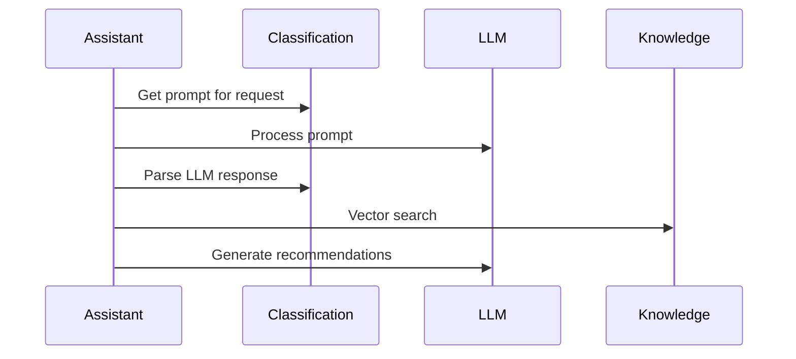

# AI Production Support Assistant

A production-ready AI support assistant system that provides intelligent analysis and resolution recommendations for production issues using Model Context Protocol (MCP) architecture and vector-based semantic search.

## Quick Start

### 1. Install Dependencies
```bash
pip install -e .
```

### 2. Run Tests
```bash
python -m pytest tests/ -v
```

### 3. Demo Mode (Automated Scenarios)
```bash
python -m support_agent.cli demo --no-interactive
```

### 4. Demo Mode (Interactive)
```bash
python -m support_agent.cli demo
```

### 5. System Health Check
```bash
python -m support_agent.cli health
```

### 6. System Information
```bash
python -m support_agent.cli info
```

## Example Usage

```
> my trade has book2 resolved to 'MarkitWire' but it did not feed outbound

Classification: query/feed_issue (High Priority, 85% confidence)

## Immediate Actions
1. **Check for Block Events:**
   ```python
   deal = ro(dealName)
   fs = deal.FeedState("MarkitWire")
   dt = fs._DownstreamTrades()[0]
   dt.validate() # investigate validation failures
   ```

2. **Check Downstream Events:**
   ```python
   deal = ro(dealName)
   ds = deal.DownstreamState("MarkitWire")
   ds.evInfo() # prints downstream events, block events
   ```

Performance: 6 tools, 5.9k tokens, 6.8 seconds
```

## Key Features

✅ **Context-Aware Analysis**: Skips redundant steps based on user's stated facts  
✅ **Vector-Based Search**: Semantic search using sentence transformers for knowledge retrieval  
✅ **Generic Feed Support**: Intelligent parameter substitution for any feed type (MarkitWire, DCPP, XODS, Bloomberg, etc.)  
✅ **LLM-Based Decisions**: No hardcoded business logic - all decisions made by LLM  
✅ **Multi-Team Support**: ATRS team with extensible architecture  
✅ **Silent Mode**: Stays silent when no relevant knowledge is available  
✅ **Production Ready**: Comprehensive error handling and robust architecture  

## Team Categories

### ATRS Team (Financial Services)
- `query` - Technical questions and troubleshooting
- `outage` - System outages and service disruptions  
- `data_issue` - Data quality and reconciliation problems
- `bless_request` - Code deployment approvals (deferred to human review)
- `review_request` - Code and architecture reviews (deferred to human review)

## Core Capabilities

1. **Intelligent Request Analysis** - Context-aware analysis with vector search
2. **Generic Feed Troubleshooting** - Works with any feed type without hardcoding  
3. **Vector Knowledge Search** - Semantic similarity search across knowledge base
4. **LLM-Based Gap Detection** - Identifies missing implementation details and searches recursively
5. **Smart Parameter Substitution** - Adapts code examples to user's specific context
6. **Silent Mode Decision Making** - Uses LLM to determine when to defer to humans

## Architecture

```
support_agent/
├── assistant.py               # Main orchestrator with vector search integration
├── cli.py                    # Command-line interface
├── config.py                 # Configuration management
└── models.py                 # Pydantic data models

mcp_servers/
├── categories/
│   └── atrs.json              # ATRS team configuration
├── classification_server.py   # LLM-based classification server
├── knowledge_server.py        # Vector search knowledge server
└── health_server.py          # Health monitoring server

knowledge_resources/           # Generic knowledge base
├── trade_feed_troubleshooting.md      # Generic feed troubleshooting
├── feed_framework_troubleshooting.md  # Feed framework commands
├── data_reconciliation.md              # Data issue procedures
└── outage_investigation.md             # Outage response procedures

tests/
└── test_functional.py         # Comprehensive functional tests
```

## Key Architectural Decisions

### 1. **Vector Embeddings for Knowledge Search**
- Uses `sentence-transformers` with `all-MiniLM-L6-v2` model
- Server-side semantic search with cosine similarity
- No fallback to keyword matching - requires proper vector search

### 2. **LLM-Based Decision Making**
- Request handling decisions made by LLM analysis
- Gap detection uses LLM to find missing implementation details
- Context awareness through intelligent prompt engineering
- No hardcoded business logic anywhere in the system

### 3. **Generic Knowledge Base**
- All knowledge files use parameterized examples (`feedType`, `dealName`)
- LLM intelligently substitutes parameters based on user context
- Works with any feed type: MarkitWire, DCPP, XODS, Bloomberg, Reuters, etc.
- No feed-type-specific hardcoded knowledge

### 4. **Client-Side LLM Pattern**


## Requirements

- Python 3.12+
- OpenAI or Anthropic API key for LLM processing
- `sentence-transformers` for vector embeddings
- `numpy>=1.26.4,<2.0` (for vector compatibility)

## Environment Variables

```bash
export OPENAI_API_KEY="your-openai-key"
# OR
export ANTHROPIC_API_KEY="your-anthropic-key"
```

## Testing

The system includes comprehensive functional tests:

- **CLI Integration Tests** - Tests all CLI commands end-to-end
- **Vector Search Tests** - Verifies semantic search functionality  
- **Context Awareness Tests** - Tests parameter substitution and context handling
- **Human Review Detection** - Tests LLM-based decision making
- **Generic Feed Support** - Tests feed type substitution across different feeds

Run tests: `python -m pytest tests/ -v`

## Configuration

### Knowledge Search Depth
Control recursive knowledge search depth:
```bash
python -m support_agent.cli demo --search-depth 2  # Recursive search
python -m support_agent.cli demo --search-depth 1  # Single-level (default)
```

### Adding New Knowledge
1. Create markdown file in `knowledge_resources/`
2. Use parameterized examples with `feedType`, `dealName`, etc.
3. Add metadata file with keywords for better search ranking
4. System automatically indexes on startup

### Example Knowledge File
```markdown
# Generic Troubleshooting Guide

## Commands
```python
deal = ro(dealName)
fs = deal.FeedState(feedType)  # Use specific feed name like "DCPP", "Bloomberg"
fs.FeedStatus()
```

The LLM will automatically substitute `feedType` with the actual feed type from user queries.

## Documentation

- [DESIGN.md](DESIGN.md) - System architecture and design decisions
- [DEMO_GUIDE.md](DEMO_GUIDE.md) - Demo walkthrough guide  
- [TESTING.md](TESTING.md) - Testing guide and documentation
- [simplified_flow_diagram.md](simplified_flow_diagram.md) - System flow overview