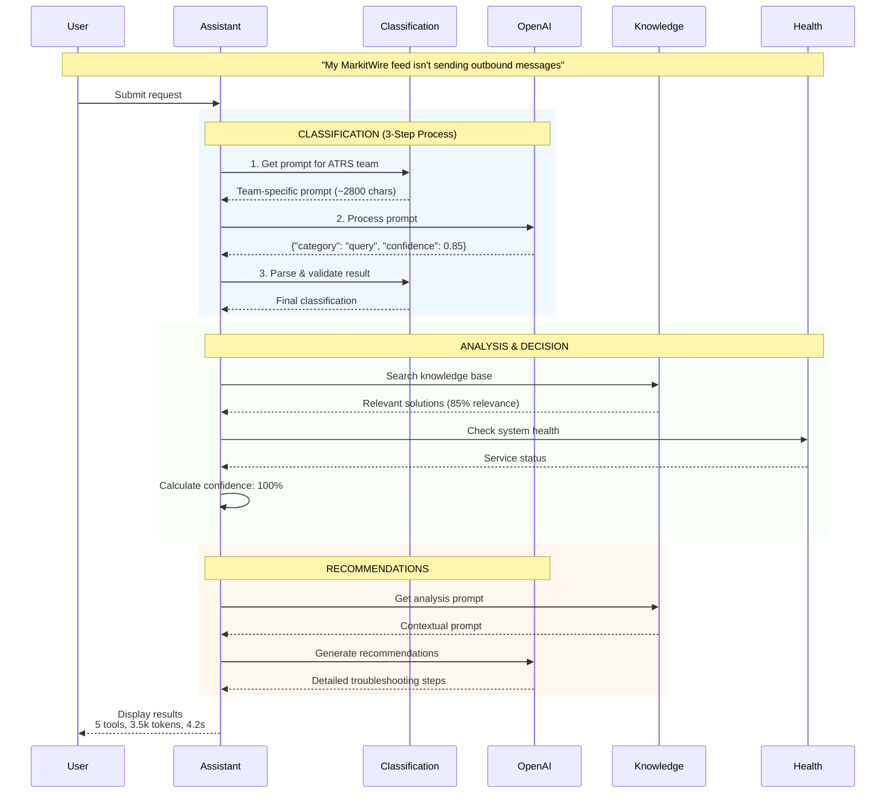
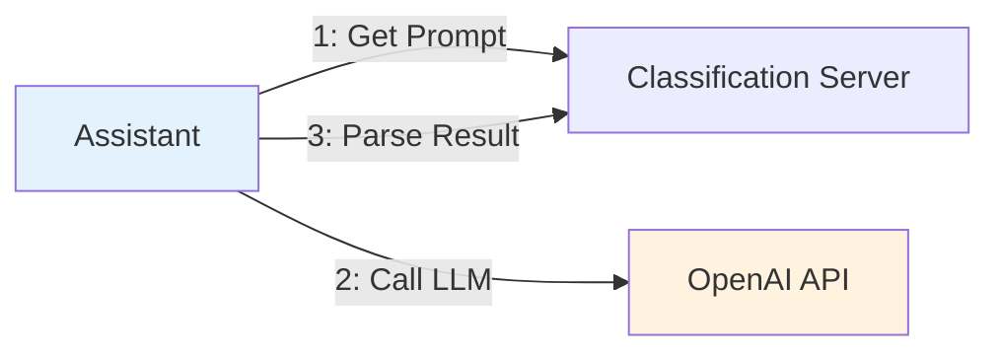
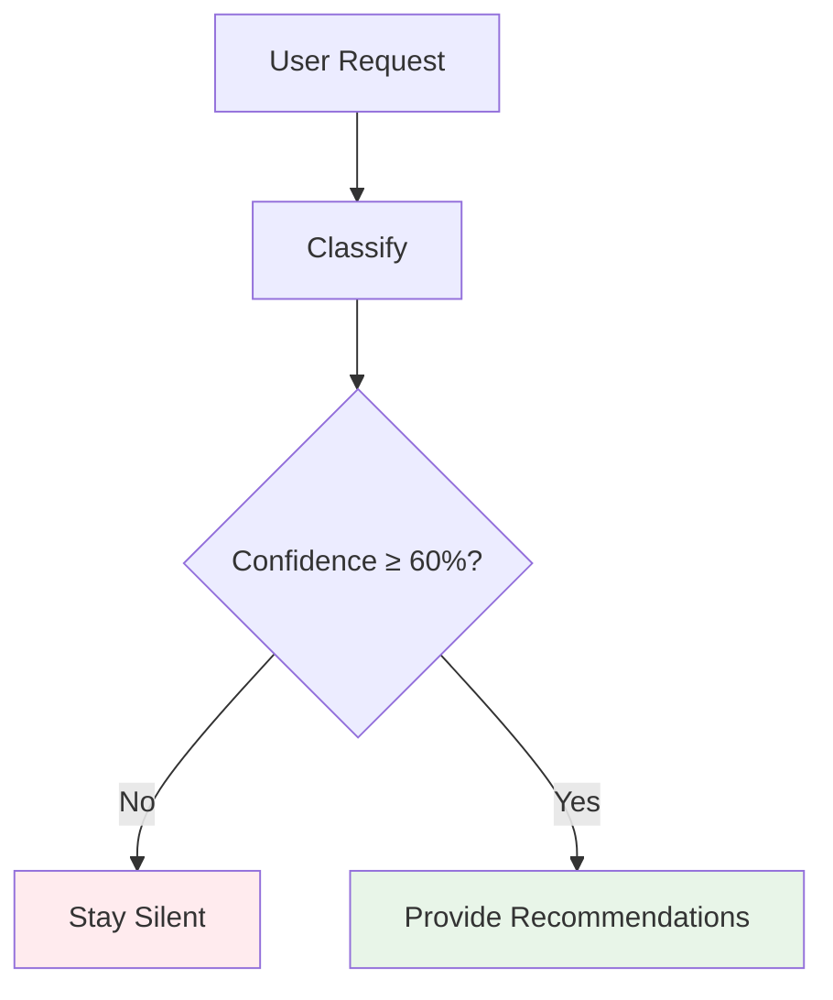
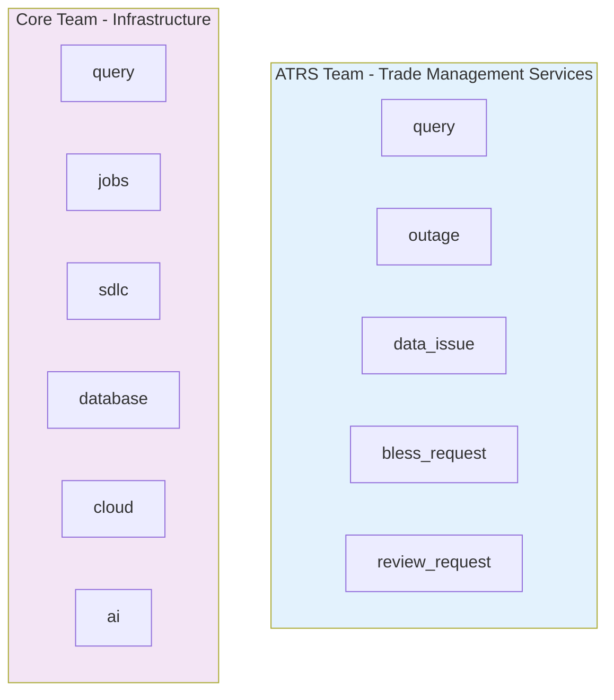

# Simplified End-to-End Flow

## **High-Level Overview**



## **Core Architecture Decisions**

### 1. **Client-Side LLM Pattern** 


### 2. **Confidence-Based Decision Tree**


### 3. **Multi-Team Support**


## **Performance Summary**

| Metric | Value | Detail |
|--------|-------|--------|
| **Response Time** | 4.2s | End-to-end processing |
| **Token Usage** | 3,500 | ~$0.01-0.02 cost |
| **Tool Calls** | 5 | Classification, Knowledge, Health |
| **LLM Calls** | 2 | Classification + Recommendations |
| **Confidence** | 100% | High enough to respond |

## **Example Output**

```
Issue Classification
   Category: query/feed_issue 
   Priority: high (85% confidence)

Resolution Steps  
   1. Check feed status: SELECT * FROM trade_feeds...
   2. Verify MarkitWire connectivity: curl -H "Auth..."
   3. Review validation results: SELECT * FROM feed_validations...
   4. Check downstream systems status
   
Analysis Details
   Confidence: 100% (Classification: 85%, Knowledge: 85%, Health: Available)
   Sources: Knowledge Base, Health Monitor
   
Performance: 5 tools, 3,500 tokens, 4.2 seconds
```

## **Key Success Factors**

- ✅ **Smart Silence**: Won't respond to vague requests or review requests  
- ✅ **Real LLM**: Uses actual OpenAI API, no mocking
- ✅ **Multi-Team**: Handles both ATRS and Core teams
