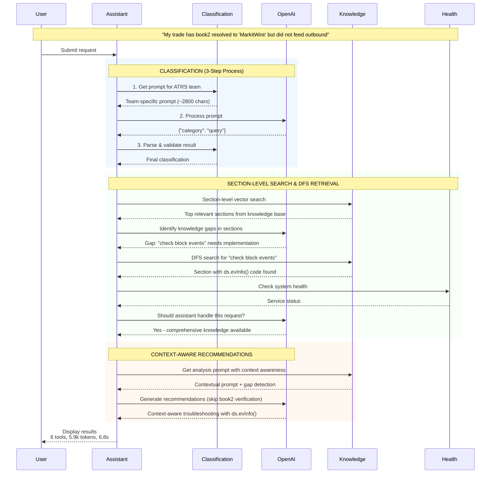
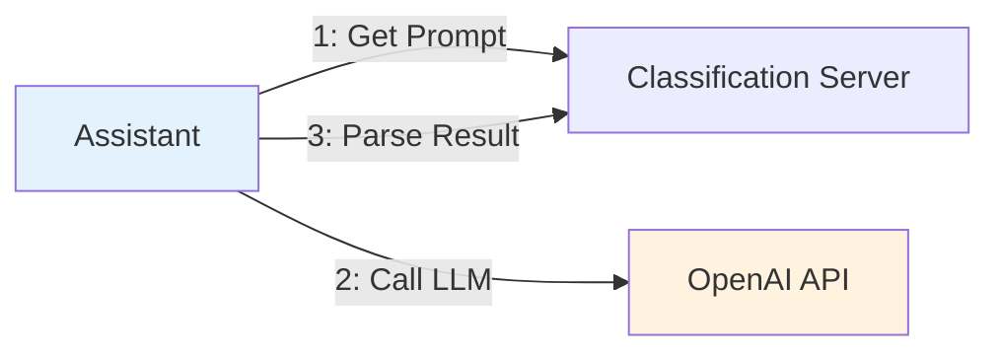
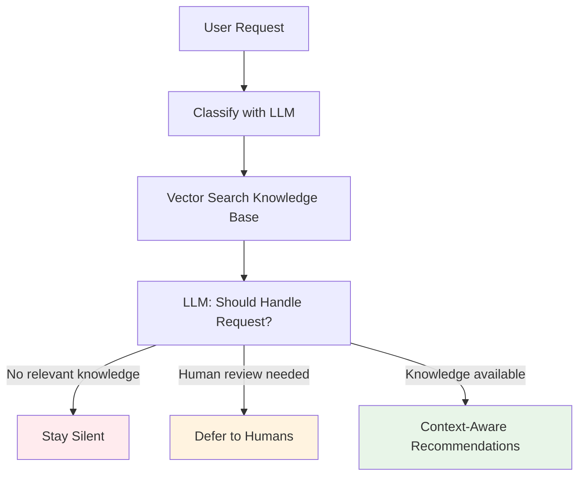
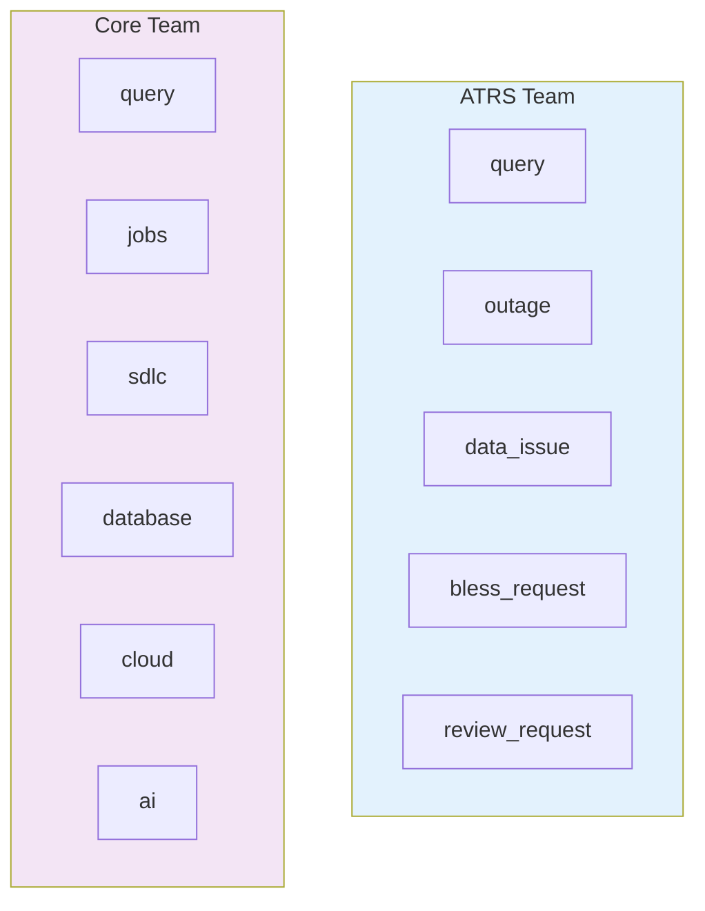

# Simplified End-to-End Flow

## **High-Level Overview**



## **Core Architecture Decisions**

### 1. **Client-Side LLM Pattern** 


### 2. **Vector-Based Knowledge & LLM Decision Tree**


### 3. **Multi-Team Support**


## **Performance Summary**

| Metric | Value | Detail |
|--------|-------|--------|
| **Response Time** | 6.8s | End-to-end processing with vector search |
| **Token Usage** | 5,900 | ~$0.02-0.03 cost |
| **Tool Calls** | 6 | Classification, Vector Search, Health, Gap Detection |
| **LLM Calls** | 3 | Classification + Decision + Recommendations |
| **Decision** | Context-Aware | Vector search + LLM decision |

## **Example Output**

```
Issue Classification
   Category: query
   Confidence: 85%

Immediate Actions
   1. **Check for Block Events:**
      ```python
      deal = ro(dealName)
      fs = deal.FeedState("MarkitWire")
      dt = fs._DownstreamTrades()[0]
      dt.validate() # investigate validation failures
      ```

   2. **Check Downstream Events:**
      ```python
      deal = ro(dealName)
      ds = deal.DownstreamState("MarkitWire")
      ds.evInfo() # prints downstream events, block events
      ```
   
Analysis Details
   Decision: Context-aware recommendations (skipped book2 verification)
   Sources: Vector search + Gap detection + Context awareness
   
Performance: 6 tools, 5,900 tokens, 6.8 seconds
```

## **Key Success Factors**

- **Vector Embeddings**: Semantic search with sentence-transformers
- **Context Awareness**: Skips redundant steps based on user's stated facts
- **Generic Feed Support**: Works with any feed type through intelligent parameter substitution
- **LLM-Based Decisions**: All logic decisions made by LLM
- **Gap Detection**: Recursively searches for missing implementation details
- **Smart Silence**: Won't respond to vague requests or categories marked for direct escalation (ex: bless requests)
- **Multi-Team**: Can be configured for use by multiple teams, with team-specific categories
